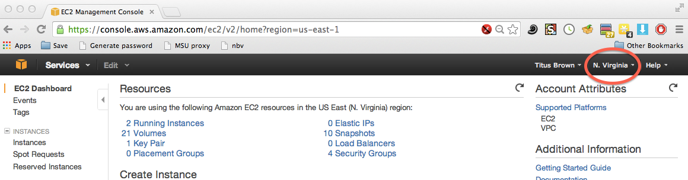
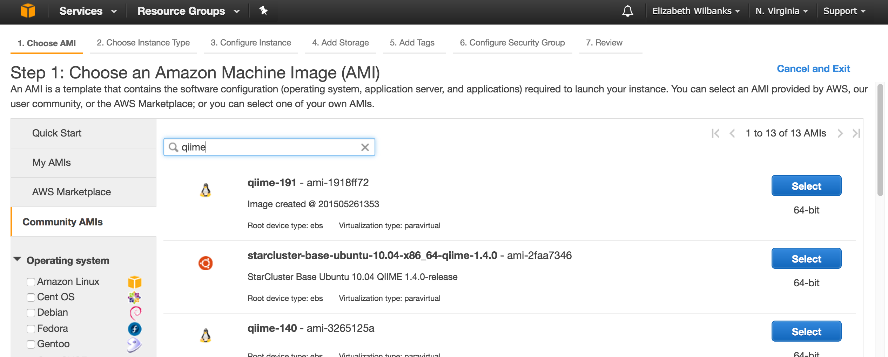
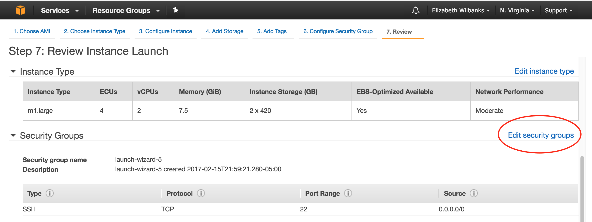
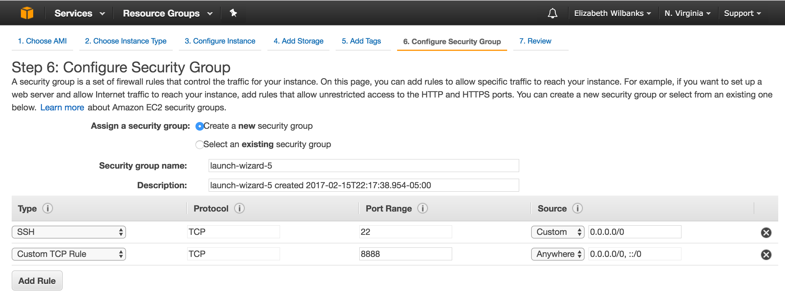
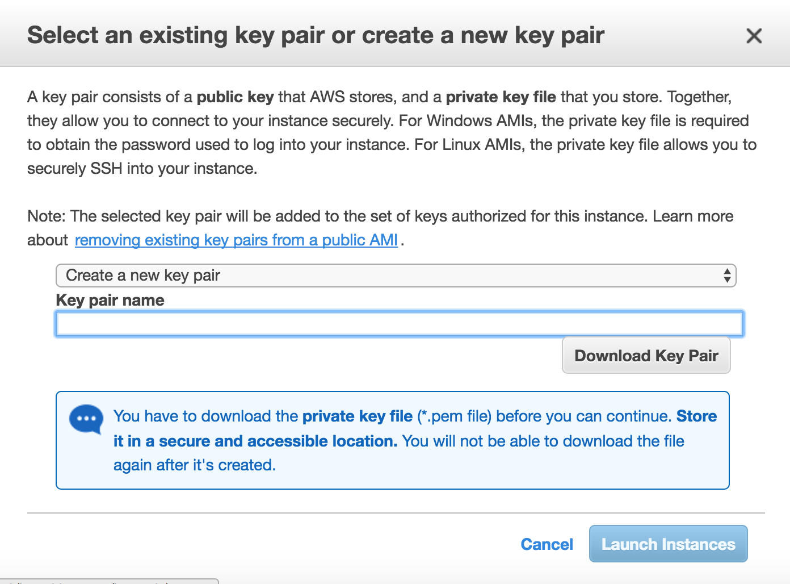

# Introduction
***
Authored by Audra Devoto

***

## Overarching Goal  
* This tutorial will teach you how to launch an AWS community server with **qiime**

## Learning Objectives
*	Understand what AWS is and how to use it
* Launch the community qiime AMI
*	Learn how to use the command line

***

# Launching a community AMI

## What is a community AMI?
* A community AMI is a remote machine that comes pre-installed with necessary software.
* Individuals or groups can set up and maintain these AMIs, and then make them available for use.
* We will be using the Qiime AMI, which is maintained by the Qiime developers. 

## What is Qiime? (pronounced chime)
* Qiime stands for Quantitative Insights Into Microbial Ecology. http://qiime.org/
* From the website: "QIIME is an open-source bioinformatics pipeline for performing microbiome analysis from raw DNA sequencing data. QIIME is designed to take users from raw sequencing data generated on the Illumina or other platforms through publication quality graphics and statistics. This includes demultiplexing and quality filtering, OTU picking, taxonomic assignment, and phylogenetic reconstruction, and diversity analyses and visualizations. QIIME has been applied to studies based on billions of sequences from tens of thousands of samples."

### Navigate to the Qiime AMI
** [Modified from ewilbanks](https://github.com/ewilbanks/micdiv2017/blob/master/tutorials/2017-02-16-launch-community-ami.md)
* Check you are in the N. Virginia Range

* Navigate to the [EC2 management console](https://console.aws.amazon.com/ec2/v2/home?region=us-east-1#LaunchInstanceWizard:)
* Click on launch an instance
* At the left click on the sidebar that says "Community AMI"
* Search for "qiime" to pull up machines that match that.
* Select the first one listed, qiime-191 - ami-1918ff72, by clicking "select"
* You can find the most recent server [here](http://qiime.org/home_static/dataFiles.html) under "Latest Amazon Web Services (AWS) virtual machine identifier"

* Select m1.large as the instance type
* Click through to review & launch  (but don't finalize launch yet)

### Set a new security rule for your instance 
To log into your QIIME instance, you’ll need to have ssh access (i.e., port 22), which is enabled by default.
Later in the tutorial today, you'll want to use IPython Notebook on your instance, so you need to add another security rule. You can do this by clicking the link circled in red below:

* Then click `Add rule`
* For the new secturity rule fill out the fields as shown below
* The Type should be Custom TCP Rule
  * the Protocol should be TCP
  * the Port Range should be 8888
  * the Source should be Anywhere


* Click 'Review and Launch' and then 'Launch'
* You will be prompted to create a security key (or use an exisiting security key if you have already made one)
* A security key is a unique file you save on your computer that acts as a password, this means only you can log into the EC2 instance you just created. 
* Select "Create a new key pair', give it a name, and download it to a stable directory that is easy to find. 



### Now log into your QIIME EC2 instance
- On the EC2 console, look up the public DNS for your instance.
- Open a terminal window (of Mobaxterm for Windows users) and `ssh` into your instance

#### Find your EC2's Public DNS:
Each EC2 instance has a Public DNS. This is an address for your EC2 instance that allows your local computer to access it. Go to [AWS](http://aws.amazon.com/), select EC2, and then view your running instances. On this page, click on your instance and find it's public DNS under the "Description" tab.


In the image above the full Public DNS of the highlighted instance is **ec2-52-5-171-50.compute-1.amazonaws.com**

#### 1. Open a Terminal:
- **Windows users** Use MobaXterm [here](http://mobaxterm.mobatek.net/download.html) to use as your terminal. 
- **MAC Users:** Terminal is under: Applications --> Utilities
- **Linux Users:** Press Ctrl + Alt + t

Now is when you will need your **key pair** you created when you launched your instance. Find it's file path using the ```cd``` command. 
 
```
cd /Downloads
```

#### 2. Change your keyfile permisions to read only:

```
chmod 400 **/path/to/your/keyfile/**.pem
```
This adjusts the permissions on your keyfile so that it cannot be edited. This is important because if the keyfile is edited or changed, it will no longer allow access to the EC2 instance.

#### 3. Connecting to your EC2 instance using ssh:

```
ssh -i **/path/to/your/keyfile/**eda.pem ubuntu@"your public DNS"
```

On your first login, you may get a prompt stating that the host authenticity cannot be established, are you sure you want to continue?  Yes, you do

SUCCESS! You have now logged into your computer in the cloud!

### 4. After the first login

After the first login to the EC2, you do not need to repeat the chmod to change permissions for the key.
Every time you start an previously-stopped EC2 instance, there will be a new Public DNS.  To connect to the EC2 after the first login, copy and paste that new Public DNS in the corresponding place below:

```
ssh -i **/path/to/your/keyfile/**EDAMAME.pem ubuntu@"your public DNS"
```

OK - now you're really ready.

### [NEXT: transfering files and launching an iPython notebook](https://github.com/oddaud/ubiome_tutorials/blob/master/tutorial_2_transfer_files.md)
