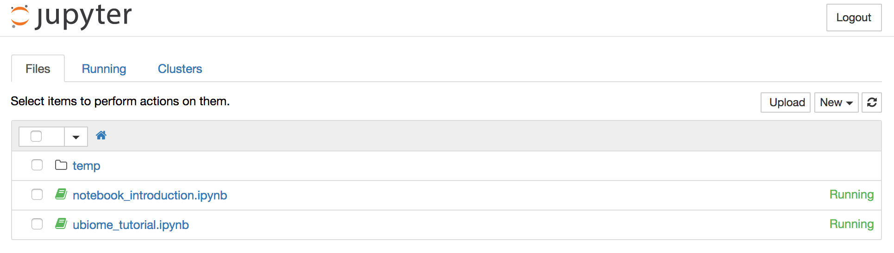

# File transfer
***
Authored by Audra Devoto

Adapted from [Elizabteth Wilbanks for Swarthmore College BIOL133, Spring 2017](https://github.com/ewilbanks/micdiv2017/blob/master/tutorials/2017-02-16-transferring-files.md), which was in turn adapted from a tutorial in EDAMAME: Explorations in Data Analysis for Metagenomic Advances in Microbial Ecology 2015
[EDAMAME-2015 EC2-files tutorial](https://github.com/edamame-course/2015-tutorials/blob/master/final/2015-06-22-EC2_Connection_FileTransfer.md)
***

## Overarching Goal  
* This tutorial will teach you how to transfer files between your local computer and **qiime**

## Learning Objectives
*	Transfer files too and from a community AWS server using `scp`
* Download publicly-hosted data to an EC2 instance using `wget`  

***

### 0.  Which terminal am I in?
It is important to keep track of which terminal you are on, your local computer, or the EC2 instance. 

- Keep your terminal window open where you have `ssh` into the EC2 machine. 
- Now, start another, new terminal window.  
 - This new window is your local computer, NOT the EC2 instance. 
- You can check this by looking at your 'present working directory' (pwd)

``` 
pwd
```

You can also check the address of the computer using
```
hostname
```
### 1. Using Downloading uBiome files

Next we will go over how to copy a file from your personal computer to your EC2 instance using `scp`. The usage is very similar to `ssh`. 

To begin, download the uBiome zipped fastq files to a directory named "ubiomeSamples" on your computer.
* Navigate to https://app.ubiome.com/samples
* Select your sample by clicking "Explore Sample"
* Under "Advanced", select "Downloads"
* Click "Download Sequence Data" (in red, below)

* Save zipped file in ubiomeSamples folder

** IMPORTANT ** You must save the IDs in your sample spreadsheet. Notice each downloaded file (folder) has a name, such as "ssr_87372" (referred to from here on as a uBiome ID). Note the sample name associated with each folder name, and save this as a column in your sample spreadsheet. Be very careful when doing this, as it can be easy to mix up sample IDs and uBiome IDs, which will cause problems later on. 

### 2. Organizing uBiome files

The uBiome files require a little bit of processing before they can be transfered to the qiime community server. 

* Navigate to the ubiomeSamples folder using the 'cd' command in the terminal. For example:
``` 
cd /Users/audradevoto/Documents/Haverford/Ubiome/ubiomeData
```
* Within the folder, you should see each of the sample folders in a .zip format. Unzip them, and remove the original .zips. 
``` 
unzip \*.zip
rm *.zip
```
* Unzip the fastq.gz files. 
```
gunzip *.gz
```
You can open these fastq files with the command
```
less filename.fastq
```
You'll notice they are quite complicated, for an explaination of the fastq file format, [read here](https://en.wikipedia.org/wiki/FASTQ_format)

You will notice there are eight fastq files for each sample. R1/R2 specifies whether or not the file has reverse reads or forward reads, and L001/L002/L003/L004 specifies what lane the sample was run on. Each sample was run four times in four different lanes, meaning L001-L004 should be very similar to each other and simply provide additional sequencing depth. We can concatenate the results from each lane to simplify analysis.
* Concatenate data from each lane into one R1 file and one R2 file.
```
for F in *L001.fastq; do
    cat ${F:0:8}*__R1__* > ${F:0:8}_R1_.fastq
done

for F in *L001.fastq; do
    cat ${F:0:8}*__R2__* > ${F:0:8}_R2_.fastq
done

#No longer a need for single files
rm *__L*
```

Great! You now have two, paired end reads for each sample, labelled ssr_xxxxx\_R1\_.fastq and ssr_xxxxx\_R2\_.fastq. 
These reads are paired end, which means they are the same fragment of DNA sequenced from each end. For more information on how paired end reads are generated, see [this blog post](http://thegenomefactory.blogspot.com/2013/08/paired-end-read-confusion-library.html) or the official [Illumina video](https://www.youtube.com/watch?time_continue=45&v=fCd6B5HRaZ8) on how its sequencing technology works.

uBiome sequences the V4 region of the 16S gene using universal V4 primers (515F: GTGCCAGCMGCCGCGGTAA and 806R:
105 GGACTACHVGGGTWTCTAAT). There are numerous theories and justifications for sequencing different sections of the 16S gene, you can read about some of them [here](https://bmcbioinformatics.biomedcentral.com/articles/10.1186/s12859-016-0992-y). 

The V4 region is 254 bp generally, but may deviate by a few bp in some cases. If you examine the length of each read in either the R1 or R2 file, you will notice that they are each 150 bp long. With a little  math, you will notice then that each V4 region is covered completely by a read from either end, with an overlap of 46 bp in the middle. Next, we need to merge them together to get the full read from the V4 region. 

But first, a little naming. It is generally better if you replace the uBiome sample name with your sample name. The must be a unique identifier, and should help you remember something about that sample. For example, I named by samples with their location (LG = longwood gardens), and a number. So LG001 was my first sample from longwood gardens. You may choose whatever naming convention you like, but keep it simple and easy to remember!

* Rename all the .fastq files. You may do this my hand in finder, BE SURE to double and triple check that you are matching up the right uBiome sample name to your sample name. Example of new names shown below. BE SURE to maintain the \_R1\_ and \_R2\_. 


Great! You are now ready to move these files over to the qiime community server and start your analysis. 

### 3. Transfer files to a community AMI

## Use ```scp``` to transfer files

We are going to copy all the concatenated uBiome fastq files from your laptop onto the remote EC2 machine (qiime community AMI).

Find your terminal window that's just your local machine (see above) and run the appropriate version of the command below. We add the ```-r``` option to recursively copy all files within the ubiomeData folder. 

NOTE you have to adapt this command to give it the right paths and DNS info!

```
scp -r -i **/path/to/your/keyfile.pem** **path/to/ubiomeData/folder/** ubuntu@"your public DNS":**/path/where/to /copy/the/file**
```

* Now look on your EC2 machine, you should see the ubiomeData folder with all the fastq's in it (R1 and R2 for each sample). 

Great job! The rest of the tutorial will be done using an iPython notebook, but first we need to transfer the notebook to your EC2 instance. 

### 4. Launch an iPython notebook

First, we need to deal with a common problem of working with ssh instances: wifi interuptions. 

What to do??

```screen
```
Screen allows processes to keep running on a remote computer even when your connection is interupted. 

To launch screen:
```
screen
```
Then hit enter. No you are working from a screen.

Launch iPython notebook. 
```
ipython notebook
```
Now the iPython notebook is running! But notice you can't run other commands, that's fine, we just need to leave this screen. To detach the screen with iPython notebook running, simply press ```ctrl``` + ```a``` simultaneously. This tells the console to send commands to the screen. Then release ```ctrl``` + ```a``` and press ```d```. This detaches the screen, you should be back to a command prompt. 

The screen is now running in the background, you can see it by typing
```
screen -ls
```
If you want to resume a screen, you would type
```
screen -r
```
[Read up here](https://kb.iu.edu/d/acuy) for more cool things you an do with ```screen```

Onto the iPython notebook!

You just need to know your instance's public DNS address and the port you set up under the security rules (8888)

* In your internet browser type in http://YOUR-EC2-DNS:8888
* For my instance that looks like the address below
* Note the colon between the DNS and the 8888 port

``` 
http://ec2-204-236-222-237.compute-1.amazonaws.com:8888
```
The password is *qiime*
The browser is now displaying the contents of your home directory. But there is nothing there yet. 

## Adding the iPython notebook
* We are going to download two notebooks, the first is an "introduction to iPython notebooks", the second will teach you how to work with your uBiome data. 
* From your EC2 terminal, use the ```wget``` command to download the two iPython notebooks.
```
wget https://raw.githubusercontent.com/oddaud/ubiome_tutorials/master/ubiome_tutorial.ipynb
wget https://gist.githubusercontent.com/ewilbanks/2a48b63c936ee528dd681d28999eb205/raw/9b2055ad3726e87fb44a006583b5500bf2ff1ee9/notebook_introduction.ipynb
```
* Go back to the internet browser running the iPython notebook
* Refresh the page, you should see both!



### 5: Work through the notebook tutorial

* Click on notebook notebook_introduction.ipynb
* It might require a password, that password is ```qiime```
* Work through the notebook!

### 6: Begin qiime tutorial!
* Navigate back to your home Jupyter screen
* Click on the tutorial ubiome_tutorial.ipynb
* Work through the tutorial!


NEXT: [Begin RDP Analysis](https://github.com/oddaud/ubiome_tutorials/blob/master/tutorial_3_RDP.md)
