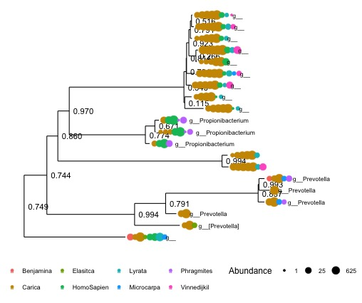
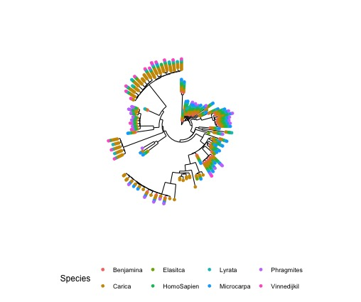
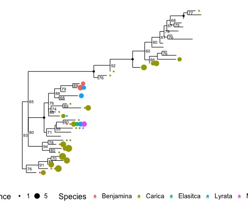

# Introduction to analysis in R: phyloseq
***
Authored by Audra Devoto

***

## Overarching Goal  
* This tutorial will teach you how use the qiime outputs in the R package ```phyloseq```.

## Learning Objectives
*	Convert qiime output into a phyloseq object
* Analyze and visualize the output uring phyloseq commands. 

***

### 0.  Getting started
You will need to have both R and R studio installed. 

* [Here](http://shapbio.me/courses/biolB215f15/install_orient.html) is a great tutorial explaining the download process.
* I also recommend beginning with the [First Steps with R](http://shapbio.me/courses/biolB215f15/first_steps.html) tutorial.
* [Here](http://www.statmethods.net/) is a great website with plenty of R resources. 

### 1. Installing phyloseq

* Open R studio. 
* From the terminal:
```
source("http://bioconductor.org/biocLite.R")
biocLite("phyloseq")
```
* If promted, enter 'a' to update all packages. 

### 2. Analyses

* Create a new R file.
* Load necessary libraries (install if not already installed, see [Installing Packages in R Studio](https://www.youtube.com/watch?v=u1r5XTqrCTQ)
```
library(phyloseq)
library(ape)
library(GUniFrac)
library(phangorn)
library(ggplot2)
```

## Creating the phyloseq object
The phyloseq object contains information about a data set, such as the OTUs, a phylogenetic tree, abundance counts, samples, and metadata.
For more information, see the [phyloseq publication](http://journals.plos.org/plosone/article?id=10.1371/journal.pone.0061217)

* First, we must import specific output files from qiime. 
* Import the .tre file:
```
uzdir <- "/path/to/merged/otus/"
mytree <- read.tree("/path/to/merged/otus/rep_set.tre")
```
* Next, import the biom file
```
biomfile = import_biom("/path/to/merged/otus/otu_table_json.biom")
```
* Map file
```
map_file <- import_qiime_sample_data("/path/to/merged/otus/map.tsv")
```
* Now we can create the phyloseq object. View the object to see a summary of its attributes
```
physeq = merge_phyloseq(mytree, biomfile, bmsd)
....
phyloseq-class experiment-level object
otu_table()   OTU Table:         [ 18055 taxa and 14 samples ]
sample_data() Sample Data:       [ 14 samples by 8 sample variables ]
tax_table()   Taxonomy Table:    [ 18055 taxa by 7 taxonomic ranks ]
phy_tree()    Phylogenetic Tree: [ 18055 tips and 18053 internal nodes ]
```
* View the rank names
```
rank_names(clst.expt)
```
Rank1 = domain, Rank2 = phylum, etc...

* Filter out the chloroplasts and mitochondria

```
clst.expt <- subset_taxa(clst.expt, Rank3!="c__Chloroplast") #gone
clst.expt <- subset_taxa(clst.expt, Rank5!="f__mitochondria") #gone
```
* Tree of the 20 most common OTUs, colored by species
```
clst.expt.20 = prune_taxa(names(sort(taxa_sums(expt), TRUE)[1:20]), clst.expt)
tree.plot.1 <- plot_tree(clst.expt.20, color="Species", size="abundance",
                         label.tips="Rank6", text.size=3, ladderize="left")
tree.plot.1 <- tree.plot.1 + theme(legend.position = "bottom",
                                   legend.title = element_text(size=12),
                                   legend.key = element_blank())
tree.plot.1
```

* tree of the 100 most common OTUs, colored by location
```
clst.expt.100 = prune_taxa(names(sort(taxa_sums(clst.expt), TRUE)[1:100]), clst.expt)
tree.plot.A <- plot_tree(clst.expt.100, color="Species", size = "abundance",text.size=3, 
                         ladderize="left",nodelabf=nodeplotblank, sizebase = 1.5)
tree.plot.A <- tree.plot.A + theme(legend.position = "bottom",
                                   legend.title = element_text(size=12),
                                   legend.key = element_blank()) + coord_polar(theta="y")
tree.plot.A 
```

* Make a tree of Oxalobacterecea OTUs only
```
clst.oxo <- subset_taxa(clst.expt, Rank5=="f__Oxalobacteraceae")
clst.oxo <- prune_samples(c("AB002","AB003","LG002","LG004",
                            "LG010","LG008","LG011", "SD001", "AB004" ), clst.oxo)

tree.plot.2 <- plot_tree(clst.oxo, color="Species", size = "abundance",
                         nodelabf=nodeplotboot(size = 3), ladderize="left",
                         label.tips = NA)
tree.plot.2 <- tree.plot.2 + theme(legend.position = "bottom",
                                   legend.title = element_text(size=16),
                                   legend.key = element_blank(), legend.text = element_text(size = 13)) #+ coord_polar(theta="y")
tree.plot.2 
```

