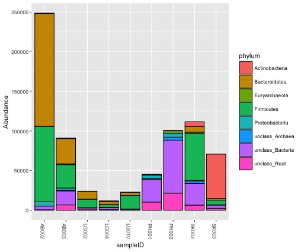
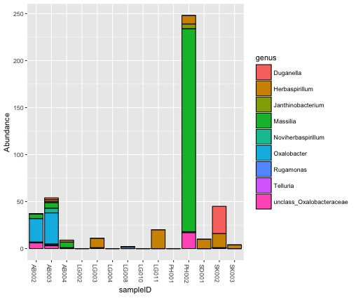

# Introduction to analysis in R: phyloseq
***
Authored by Audra Devoto

***

## Overarching Goal  
* This tutorial will teach you how use the qiime outputs in the R package ```phyloseq```.

## Learning Objectives
*	Convert qiime output into a phyloseq object
* Analyze and visualize the output uring phyloseq commands. 

***

### 0.  Getting started
You will need to have both R and R studio installed. 

* [Here](http://shapbio.me/courses/biolB215f15/install_orient.html) is a great tutorial explaining the download process.
* I also recommend beginning with the [First Steps with R](http://shapbio.me/courses/biolB215f15/first_steps.html) tutorial.
* [Here](http://www.statmethods.net/) is a great website with plenty of R resources. 

### 1. Installing phyloseq

* Open R studio. 
* From the terminal:
```
source("http://bioconductor.org/biocLite.R")
biocLite("phyloseq")
```
* If promted, enter 'a' to update all packages. 

### 2. Analyses

* Create a new R file.
* Load necessary libraries (install if not already installed, see [Installing Packages in R Studio](https://www.youtube.com/watch?v=u1r5XTqrCTQ)
```
library(phyloseq)
library(ape)
library(GUniFrac)
library(phangorn)
library(ggplot2)
```

## Creating the phyloseq object
The phyloseq object contains information about a data set, such as the OTUs, a phylogenetic tree, abundance counts, samples, and metadata.
For more information, see the [phyloseq publication](http://journals.plos.org/plosone/article?id=10.1371/journal.pone.0061217)

* First, we must import specific output files from qiime. 
* Import the .tre file:
```
uzdir <- "/path/to/merged/otus/"
mytree <- read.tree("/path/to/merged/otus/rep_set.tre")
```
* Next, import the biom file
```
biomfile = import_biom("/path/to/merged/otus/otu_table_json.biom")
```
* Map file
```
map_file <- import_qiime_sample_data("/path/to/merged/otus/map.tsv")
```
* Now we can create the phyloseq object. View the object to see a summary of its attributes
```
physeq = merge_phyloseq(mytree, biomfile, bmsd)
....
phyloseq-class experiment-level object
otu_table()   OTU Table:         [ 18055 taxa and 14 samples ]
sample_data() Sample Data:       [ 14 samples by 8 sample variables ]
tax_table()   Taxonomy Table:    [ 18055 taxa by 7 taxonomic ranks ]
phy_tree()    Phylogenetic Tree: [ 18055 tips and 18053 internal nodes ]
```
* View the rank names
```
rank_names(clst.expt)
```
Rank1 = domain, Rank2 = phylum, etc...

* Filter out the chloroplasts and mitochondria

```
expt <- subset_taxa(expt, Rank3!="c__Chloroplast") #gone
expt <- subset_taxa(expt, Rank5!="f__mitochondria") #gone
```
 * 
 ### USING RDP INPUT ###
* Import as a phyloseq object
```
taxa.expt <- hier2phyloseq("path/to/RDP/output/all_hier.txt")
#Add in metadata file
sam.data <- read.csv(file="/path/to/sample.data.csv", row.names=1, header=TRUE)
sample_data(taxa.expt) <- sam.data
#Remove chloroplasts and some unnecessary samples
get_taxa_unique(taxa.expt, taxonomic.rank="phylum")
taxa.expt <- subset_taxa(taxa.expt, phylum!="Cyanobacteria/Chloroplast")
 ```
 * Plot by Phylum. This is confusing, so we should filter out the phyla with low abundance
 ```
 taxa.p <- tax_glom(expt, taxrank="phylum")
 plot_bar(taxa.p, x="sampleID", fill="phylum")
```

* You can prune out certain samples with a low sequence count
```
sample_sums(expt)
taxa.pruned<- prune_samples(c("AB002.R1..merged","AB003.R1..merged","LG002.R1..merged","LG004.R1..merged",
                              "LG010.R1..merged","PH002.R1..merged","PH001.R1..merged"), taxa.arch)
```
* Then remove phyla with < 1% abundance
```
otu <- otu_table(taxa.pruned)
otu.pc <- prop.table(otu, margin = 2)*100
keep <- apply(otu.pc, 1, max)>=1
table(keep)

temp <- prune_taxa(keep, taxa.pruned)
temp <-  tax_glom(temp, taxrank="phylum")
plot_bar(temp, x="sampleID", fill="phylum")
```

 * Seperate out just one family
 ```
taxa.oxo <- subset_taxa(taxa.expt, family=="Oxalobacteraceae")
plot_bar(taxa.pruned, x="sampleID", fill="genus")
 ```

 * Rarefy data, calculate alpha diversity. May need to remove some samples with very low sequencing depth
 ```
sample_sums(taxa.expt)
taxa.pruned<- prune_samples(c("AB002.R1..merged","AB003.R1..merged","LG002.R1..merged","LG004.R1..merged",
                              "LG010.R1..merged","PH002.R1..merged","PH001.R1..merged","SK002.R1..merged",
                              "SK003.R1..merged"), taxa.expt)
taxa.r <- rarefy_even_depth(taxa.pruned, rngseed=TRUE)
sample_sums(taxa.r) #Down to 5827 seq/samples

p5 <- plot_richness(taxa.r, x="species", measures="Shannon", color = "location")
p5 + theme(axis.text.x = element_text(size=10)) + geom_point(aes(size = 2))
```


* Make a network based on different distance calculations
```
taxa.expt.200 = prune_taxa(names(sort(taxa_sums(taxa.expt), TRUE)[1:200]), taxa.expt)
tg <- make_network(taxa.expt.200, "samples", "jaccard", 0.8, keep.isolates = TRUE)
plot_network(tg, taxa.expt.200,line_weight = 0.4, label = NULL, color = "location")
```

