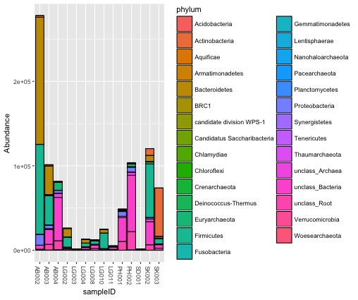
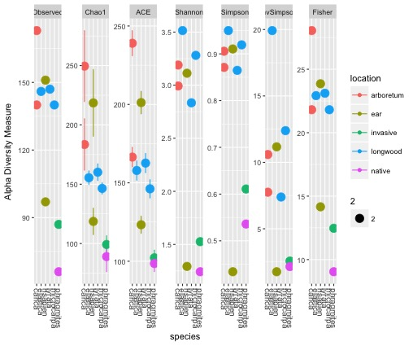
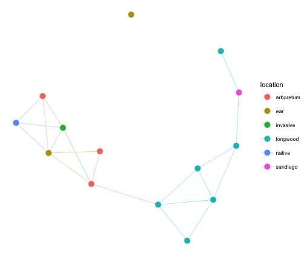

### Classifying with RDP ###

## 0. Install RDP
(Skip if using a computer with RDP pre-installed)
[Click here to install](https://rdp.cme.msu.edu/)

## 1. Run classifier
* RDP classifier works on split fastq files. 
* Transfer the individual, cleaned fastq files from the AWS server to your local computer, and link to them as shown below:

```
java -Xmx2g -jar /path/to/RDPTools/classifier.jar classify -c 0.5 -f filterbyconf -o test_classified.txt -h test_hier.txt sample_files/*.fastq
```
* This will output a file called all_classified.txt, which contains the classification for every sequence read
* all_hier.txt = hierarchy file
* cnadjusted_all_hier.txt = copy number adjusted hierarchy file

## 2. Import hier file as a phyloseq object

```
taxa.expt <- hier2phyloseq("path/to/RDP/output/all_hier.txt")
#Add in metadata file
sam.data <- read.csv(file="/path/to/sample.data.csv", row.names=1, header=TRUE)
sample_data(taxa.expt) <- sam.data
#Remove chloroplasts and some unnecessary samples
get_taxa_unique(taxa.expt, taxonomic.rank="phylum")
taxa.expt <- subset_taxa(taxa.expt, phylum!="Cyanobacteria/Chloroplast")
 ```
 * Plot by Phylum. This is confusing, so we should filter out the phyla with low abundance
 ```
 taxa.p <- tax_glom(expt, taxrank="phylum")
 plot_bar(taxa.p, x="sampleID", fill="phylum")
```

* You can prune out certain samples with a low sequence count
```
sample_sums(expt)
taxa.pruned<- prune_samples(c("AB002.R1..merged","AB003.R1..merged","LG002.R1..merged","LG004.R1..merged",
                              "LG010.R1..merged","PH002.R1..merged","PH001.R1..merged"), taxa.arch)
```
* Then remove phyla with < 1% abundance
```
otu <- otu_table(taxa.pruned)
otu.pc <- prop.table(otu, margin = 2)*100
keep <- apply(otu.pc, 1, max)>=1
table(keep)

temp <- prune_taxa(keep, taxa.pruned)
temp <-  tax_glom(temp, taxrank="phylum")
plot_bar(temp, x="sampleID", fill="phylum")
```

 * Seperate out just one family
 ```
taxa.oxo <- subset_taxa(taxa.expt, family=="Oxalobacteraceae")
plot_bar(taxa.pruned, x="sampleID", fill="genus")
 ```

 * Rarefy data, calculate alpha diversity. May need to remove some samples with very low sequencing depth
 ```
sample_sums(taxa.expt)
taxa.pruned<- prune_samples(c("AB002.R1..merged","AB003.R1..merged","LG002.R1..merged","LG004.R1..merged",
                              "LG010.R1..merged","PH002.R1..merged","PH001.R1..merged","SK002.R1..merged",
                              "SK003.R1..merged"), taxa.expt)
taxa.r <- rarefy_even_depth(taxa.pruned, rngseed=TRUE)
sample_sums(taxa.r) #Down to 5827 seq/samples

p5 <- plot_richness(taxa.r, x="species", measures="Shannon", color = "location")
p5 + theme(axis.text.x = element_text(size=10)) + geom_point(aes(size = 2))
```


* Make a network based on different distance calculations
```
taxa.expt.200 = prune_taxa(names(sort(taxa_sums(taxa.expt), TRUE)[1:200]), taxa.expt)
tg <- make_network(taxa.expt.200, "samples", "jaccard", 0.8, keep.isolates = TRUE)
plot_network(tg, taxa.expt.200,line_weight = 0.4, label = NULL, color = "location")
```

